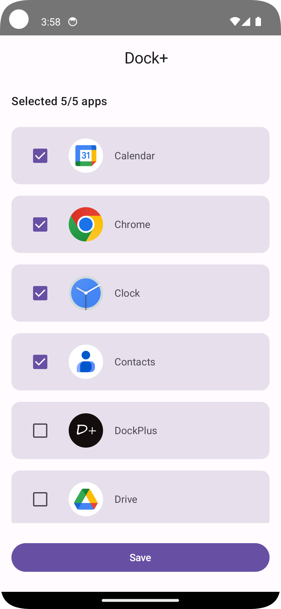

# DockPlus

DockPlus is an Android app that allows users to create a customizable dock on their screen, enabling quick access to their favorite applications, similar to the docks found in Linux and macOS.

## Features

- **Customizable Doc**: Users can select up to 5 apps to display in their dock.
- **Quick Launch**: Easily launch your favorite apps directly from the dock.
- **Overlay Functionality**: DockPlus runs as an overlay, providing seamless access to apps without interrupting your workflow.
- **User-friendly Interface**: Simple and intuitive design for easy navigation.

## Screenshots

| Sidebar Dock | Home Screen |
|:-----------:|:-----------:|
|  |  |

## Installation

1. Clone the repository:
```bash
   git clone https://github.com/mukundsolanki/DockPlus.git
```
2. Open the project in Android Studio.
   
3. Build and run the project on an Android device or emulator.

## Contributing

Feel free to open issues or submit pull requests if you'd like to contribute to the project.

## License

This project is licensed under the MIT License. See the LICENSE file for more details.
